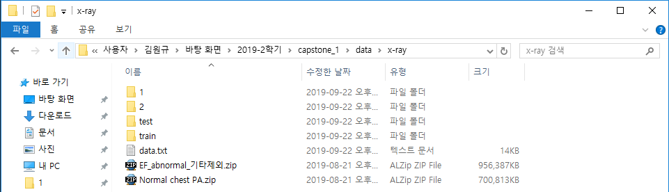
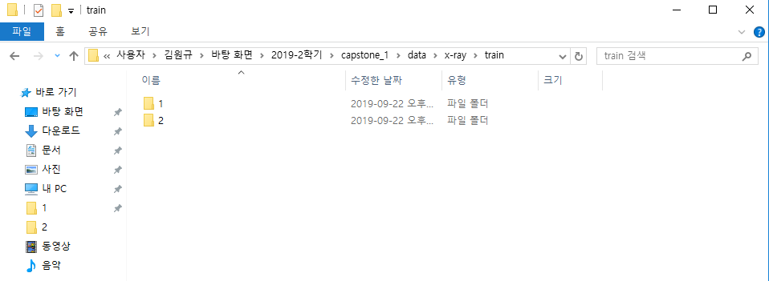

## X-RAY 영상분석

기존 데이터를 다음과 같이 변경하여 저장하였습니다.
Normal chest PA -> 1 (618장)
EF_abnormal_기타제외 -> 2 (816장)

이제 1, 2로 이름이 바뀐 데이터 폴더는 다음과 같이 train, test로 분리하였습니다.
normal - train: 588장, test: 30장
abnormal - train: 786장, test: 30장

